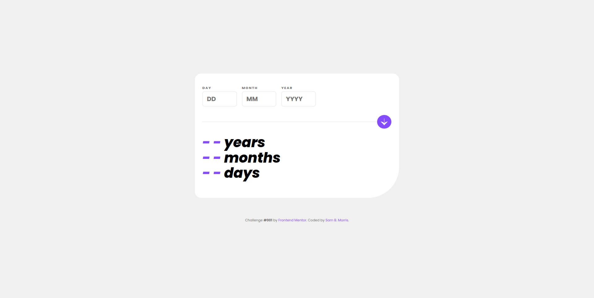

# Age Calculator App (Frontend Mentor)
## Challenge #001

## Welcome 👋
This is a solution to the [Age calculator app challenge on Frontend Mentor](https://www.frontendmentor.io/challenges/age-calculator-app-dF9DFFpj-Q). This is my 1st  User Interface (UI) component challenge.

## Table of contents

- [The challenge](#the-challenge)
- [My process](#my-process)
  - [Built with](#built-with)
  - [What I learned](#what-i-learned)
  - [Useful resources](#useful-resources)
- [Author](#author)

## The challenge

Users should be able to:

- View an age in years, months, and days after submitting a valid date through the form
- Receive validation errors if:
  - Any field is empty when the form is submitted
  - The day number is not between 1-31
  - The month number is not between 1-12
  - The year is in the future
  - The date is invalid e.g. 31/04/1991 (there are 30 days in April)
- View the optimal layout for the interface depending on their device's screen size
- See hover and focus states for all interactive elements on the page

## My process
### Built with

- Semantic HTML5
- CSS
- Vanilla JavaScript
`

### Useful resources

- [Mozilla Developer Network (MDN)](https://developer.mozilla.org/en-US/docs/Web/JavaScript/Guide/Regular_expressions) - This helped me learn a bit about regular expressions and how to properly use the <Code>.then()</code> method.

- [Chat GPT](https://www.chat.openai.com) - I used it to show me how to accurately calculate the years, months and days.

## Author
### Sam B. Morris
- Codewars - [@divinestylus](https://www.codewars.com/users/divinestylus)
- Frontend Mentor - [@divinestylus](https://www.frontendmentor.io/profile/divinestylus)
- Twitter - [@divinestylus](https://www.twitter.com/divinestylus)